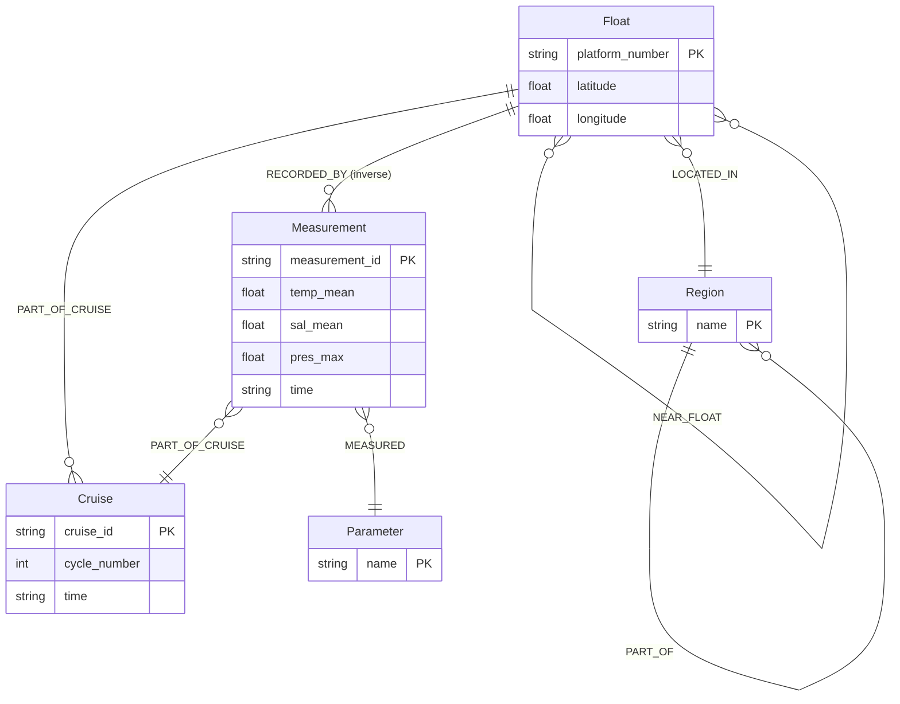

# CognoDB Graph Database Extension

This document covers the CognoDB-backed knowledge graph layer added for the take-home assignment. The existing FastAPI + Next.js architecture is preserved; graph features are an extension.

## Architecture conflicts flagged

| Area | Existing behavior | Graph extension |
|------|-------------------|-----------------|
| **Neo4j Aura URI** | Hardcoded `neo4j+s://dddeab17.databases.neo4j.io` in `metadata_insert.py` | Use CognoDB via `COGNODB_URI` env vars; old script kept but superseded by `seed_cognodb.py` |
| **Relationship names** | `MEASURES`, `PART_OF` | Assignment schema: `MEASURED`, `RECORDED_BY`, `PART_OF_CRUISE`, `NEAR_FLOAT` — `neo4j_tool` updated; vector/Cockroach paths unchanged |
| **Metadata source** | `metadata_insert.py` required CockroachDB | `seed_cognodb.py` reads `backend-maps/argo_data.csv` directly |
| **Measurement granularity** | CockroachDB stores ~460k depth rows | Graph stores **profile-level** `Measurement` nodes (one per float+cycle) to keep CognoDB practical; depth rows remain in CSV/Cockroach |

---

## Why a graph database?

Relational schemas excel at tabular measurements but struggle with **relationship-first** oceanographic questions without heavy joins and recursive SQL.

**Graph advantages for Argo data:**

1. **Multi-hop traversals** — e.g. “floats in Arabian Sea that recorded temperature during cruise `1901442_295`” is a natural path: `Region ← LOCATED_IN ← Float ← RECORDED_BY ← Measurement → PART_OF_CRUISE → Cruise` and `→ MEASURED → Parameter`. In SQL this requires multiple joins across normalized tables per hop.

2. **Proximity / drift networks** — `NEAR_FLOAT` edges encode spatial adjacency. **Shortest path** between floats (`shortestPath` in openCypher) is awkward in SQL (recursive CTEs + precomputed distance matrix).

3. **Pattern overlap** — finding floats that **share cruises** in the same region with similar temperature/salinity profiles crosses float, cruise, measurement, and region entities — graph pattern matching is the native query model.

4. **Schema flexibility** — new relationship types (e.g. `CO_DEPLOYED_WITH`, `INSTRUMENT_ON`) can be added without migrations across join tables.

---

## Data model



### Node types

| Label | Key | Description |
|-------|-----|-------------|
| `Float` | `platform_number` | Argo profiling float (88 in dataset) |
| `Cruise` | `cruise_id` | Profiling cycle (`{platform}_{cycle}`) |
| `Region` | `name` | Geographic region (Arabian Sea, etc.) |
| `Measurement` | `measurement_id` | Profile summary per cycle |
| `Parameter` | `name` | temperature, salinity, pressure |

### Relationships

| Type | From → To | Purpose |
|------|-----------|---------|
| `RECORDED_BY` | Measurement → Float | Who recorded the profile |
| `LOCATED_IN` | Float → Region | Regional assignment |
| `PART_OF_CRUISE` | Float → Cruise, Measurement → Cruise | Cycle linkage |
| `MEASURED` | Measurement → Parameter | Parameter values on relationship `value` |
| `PART_OF` | Region → Region | Hierarchy (subregion → Indian Ocean) |
| `NEAR_FLOAT` | Float → Float | Proximity network (`distance_km` ≤ 120) |

---

## CognoDB setup

1. Create a CognoDB instance at [cognodb.cloud](https://cognodb.cloud).
2. Copy connection URI, username, and password from the downloaded credentials file.
3. Create `backend-chatbot-test/.env` (never commit):

```env
COGNODB_URI=bolt+s://db-4dcfe13c.databases.cognodb.com
COGNODB_USER=cognodb
COGNODB_PASSWORD=<from-downloaded-file>
```

4. Test connection:

```bash
cd backend-chatbot-test
pip install neo4j python-dotenv pandas tqdm
python scripts/test_cognodb_connection.py
```

5. Seed the graph:

```bash
python Data_populating/seed_cognodb.py
# Optional: --clear to wipe graph first
# Optional: --skip-measurements for floats/regions only
```

---

## Main Cypher queries

### 1. Multi-hop: floats in region with parameter during cruise

```cypher
MATCH (r:Region {name: $region_name})
MATCH (f:Float)-[:LOCATED_IN]->(r)
MATCH (m:Measurement)-[:RECORDED_BY]->(f)
MATCH (m)-[:PART_OF_CRUISE]->(c:Cruise {cruise_id: $cruise_id})
MATCH (m)-[:MEASURED]->(p:Parameter {name: $parameter_name})
RETURN DISTINCT f.platform_number, c.cruise_id, p.name, m.time
```

API: `GET /api/graph/query/multi-hop?region=Arabian Sea&parameter=temperature&cruise_id=1901442_295`

### 2. Shortest path between floats (awkward in SQL)

```cypher
MATCH (a:Float {platform_number: $float_a}), (b:Float {platform_number: $float_b})
MATCH path = shortestPath((a)-[:NEAR_FLOAT*..6]-(b))
RETURN [n IN nodes(path) | n.platform_number] AS float_path, length(path) AS hops
```

API: `GET /api/graph/query/shortest-path?float_a=1901442&float_b=2901550`

### 3. Overlapping measurement patterns

```cypher
MATCH (f:Float {platform_number: $float_id})-[:LOCATED_IN]->(r:Region)
MATCH (other:Float)-[:LOCATED_IN]->(r)
WHERE other.platform_number <> $float_id
MATCH (m1:Measurement)-[:RECORDED_BY]->(f)
MATCH (m1)-[:PART_OF_CRUISE]->(c:Cruise)
MATCH (m2:Measurement)-[:RECORDED_BY]->(other)
MATCH (m2)-[:PART_OF_CRUISE]->(c)
RETURN other.platform_number, count(DISTINCT c) AS shared_cruises
ORDER BY shared_cruises DESC
```

API: `GET /api/graph/query/similar-patterns/1901442`

---

## Agent integration

The **MetadataAgent** in `agent/multi_agent_rag.py` uses `Neo4jTool` (CognoDB-backed) as a **graph retriever**:

- Float/region metadata from graph traversals
- Shortest-path queries when user asks about paths between floats
- Similar-pattern queries for overlapping cruise profiles
- Falls back to static defaults if CognoDB is unreachable (existing graceful degradation)

Vector search (Pinecone) and time-series (Cockroach/CSV) remain unchanged.

---

## UI: Knowledge Graph Explorer

Sidebar → **Knowledge Graph** (`?view=graph`)

- **Loading** — skeleton placeholders while fetching health + regions
- **Error** — CognoDB unreachable with retry button
- **Empty** — connected but no nodes (prompts to run seed script)
- **Ready** — browse regions → floats → relationships; run shortest-path and similarity queries

### Screenshots

_Add screenshots after running locally:_

1. Graph explorer with regions and float counts
2. Float detail with NEAR_FLOAT neighbors
3. Shortest-path query result
4. Chatbot answer using graph metadata

---

## API endpoints

| Endpoint | Description |
|----------|-------------|
| `GET /api/graph/health` | CognoDB connectivity |
| `GET /api/graph/stats` | Node/relationship counts |
| `GET /api/graph/regions` | All regions |
| `GET /api/graph/regions/{name}/floats` | Floats in region |
| `GET /api/graph/floats/{id}` | Float graph detail |
| `GET /api/graph/query/multi-hop` | Multi-hop traversal |
| `GET /api/graph/query/shortest-path` | Proximity shortest path |
| `GET /api/graph/query/similar-patterns/{id}` | Pattern overlap |

---

## Running the full stack

```bash
# Backend (from backend-chatbot-test/API)
python main.py

# Frontend (from frontend)
npm run dev
# → http://localhost:9002
```
